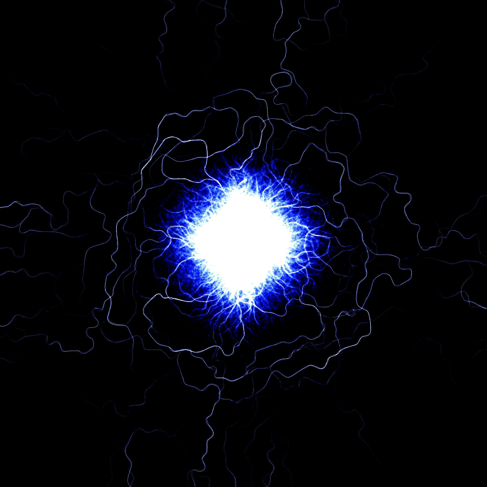
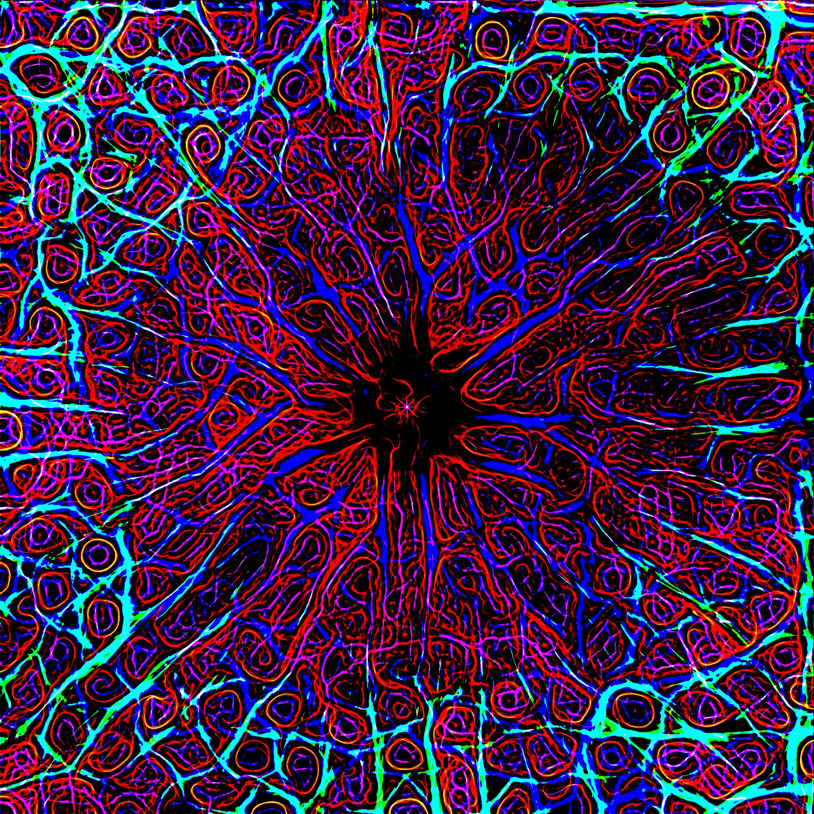
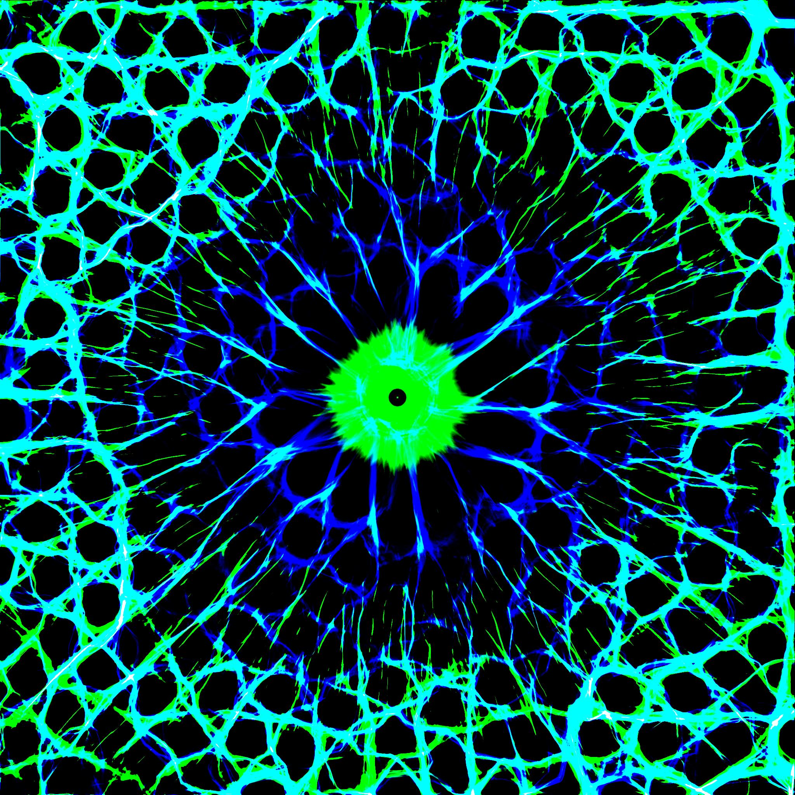

# Slime Simulator

Slime sim is a GPU agent simulaton. 
Eac agent is represented as a coloured pixel on a texteue and moves around with a given speed and direction.
Depending on their properties they will make all sorts of patters when attempting to follow the places where the trail is brightest.

---

## How To Run
1. Download the build directory as .zip from (./Build)
2. Extract the zip file.  
3. Run `SlimeSim.exe`.  
4. Play around with the settings to see what you can make. (For a more detailed explaination of what the parameters do see below)

---
### Example images
---
<p align="center">
  
  
  
  
</p>

---

## Features
- Settings panel  
   - Many variable parameters
   - Custom colour picker
   - Spawn center mode
   - Bounce or wrapping mode

- Agent Simulation  
  - Easily handles > 2 million agents on a 2048x2048 render texture. (GTX 1660 SUPER 6GB) 
  - Agents attempt to follow trails based on brightness
  - Agents have a lifespan that can be extended by spending time on brighter pixels (this effect can be scaled by the blm or BrightnessLifetimeModifier)
  - Agents sample 3 points in front of them offset by their "Sensor Angle" and at a distance from them of "Sensor Distance" pixels

- Image Saving
  - Save button goes to "AppData/LocalLow/DefaultCompany/SlimeSim/"
---

## Development
1. Clone the repository and open it in Visual Studio 2019:
2. Right click solution and "Restone NuGet Packages"

```bash
git clone https://github.com/yourusername/CoCSaver.git
